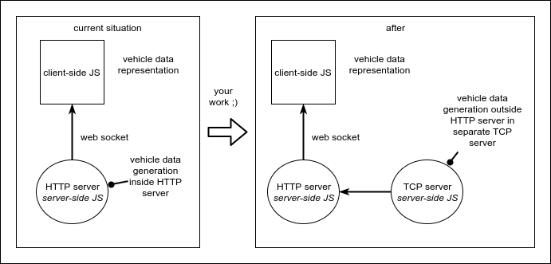

# ViriCiti Example App
This repository holds the ViriCiti Example App starter kit.

We've set up the full project for you with Webpack, Node.js, Express, Socket.io, React.js and Less. This should provide you with the tools to build a cool web app!

## Getting Started
First, fork the repository at:

`https://github.com/viriciti/assignment`

Then open up your terminal and clone the forked repository

<sup>Replace [YOUR_USERNAME] with your name</sup>

`git clone https://github.com/[YOUR_USERNAME]/assignment.git`

Enter the directory

`cd assignment`

Install all the dependencies

`npm i`

Run the project

`npm start`

Finally, open up your browser at
<a href='http://localhost:1337'>http://localhost:1337</a>


## The Assignment
We have provided you with a starter kit that receives vehicle data in the front-end over a socket connection. This is all setup for you. The assignment can be done from two perspectives: you can choose whatever you would like to do:

1. Doing the assignment focused on **_front-end_**
1. Doing the assignment focused on **_back-end_**

More on this later.

We've provided you with a few parameters:

### The data
The assignment is based on a vehicle data generator. A stream of objects that looks like this:

```JS
{
  time: 1511512585495,
  energy: 85.14600000000002,
  gps: ["52.08940124511719","5.105764865875244"],
  odo: 5.381999999997788,
  speed: 12,
  soc: 88.00000000000007
}
```

* time - Unix timestamp of the moment the datapoint was recorder
* energy - Energy used in kWh
* gps - Latitude and longitude where the datapoint was recorded
* odo - The distance driven in km
* speed - The speed the vehicle was going in km/h
* soc - The state of charge (battery) of the vehicle in %

Now choose what you would like to do, front-end of back-end work, and pick the appropriate assignment!
### Front-end based assignment
We would like to see how you can visualize the vehicle data for the end-user. What does the user want to see and how are you going to display this? Give the user real-time insights into his/her vehicle.

We highly encourage you to use your creativity in this assignment. However, we do have some requirements it needs to meet:

#### Front-end - The requirements
Your app needs to at least:

* provide the user with useful insights in data through data visualizations (e.g. D3.js)
* be modular (in React.js components)
* have re-usable components and be coded DRY (Don't Repeat Yourself)
* be fully responsive and mobile friendly
* use Less in a structured way for styles

#### Front-end - Up for more?
Cool! You could extend the app's functionality by:
* Enrich the data-set with different data sources (e.g. weather API)
* Optimize page loading (performance)
* Global state management, like using Redux.js
* Service workers
* Progressive Web App

### Back-end based assignment
You choose to leave the client-side JS app in the example application as it is and concentrate on the back-end. Awesome!

In the example application you will find a **Vehicle** data generator in `src/server/lib/Vehicle.js`. This generator is part of a node HTTP server. Now, it is your task to create a separate service for this generator, so that, potentially, more services could make use of it. The image below depicts the current situation and the preferred situation.



Move the data generator from `src/server/lib/vehicle.js`, which is now a node module included in the HTTP server, to another process: a TCP server. For the HTTP server to keep receiving the vehicle data, it needs to connect to  (as a TCP client) this new TCP server that is running the _vehicle data generator_. To make it a bit more interesting, the port on the TCP server should be an arbitrary port, so you will need to make use of some sort of service discovery. i.e. [Consul](www.consul.io) may be a good choice, but [etcd](https://coreos.com/etcd/) is interesting too.

#### Back-end - Requirements
* Your modified back-end needs three services, a HTTP server, a TCP server and the (third-party) service discovery service.
* The TCP server registers its port in the service discovery
* The TCP server generates the vehicle data and streams it over a TCP connection
* The HTTP server, hosting the web client, connects to this TCP server and receives its data

#### Back-end - Up for more?
Nice! Now that is working and if you still have some energy (and time ;) ) left, how about:
* make the HTTP server reconnect with the TCP server after the connection is dropped (implement a reconnection strategy)
* allow multiple HTTP servers to connect to you TCP server
*  putting your servers into docker images
* improve the Vehicle.js module! (it lacks re-reading it's source file after reading through it)

## The project structure
The project structure is pretty straight forward. Below you can find some of the things you might be looking for.

### Node.js and Express server

This project runs on a node HTTP server using Express. You can find the server's entry file here:

`src/server/index.js`

### React.js front-end

This project uses React.js in the front-end. You can find the mounting of the app here:

`src/client/main.js`

### Less for styles

This project uses Less for styling. You can find the main Less file here:

`src/client/less/app.less`

## Read up material
Looking to level up your knowledge and skills? These are some good articles/courses that you can check out.

### Front-end
* [Atomic Design](http://atomicdesign.bradfrost.com/chapter-2/)
* [BEM](http://getbem.com/)
* [LearnYouReact](https://github.com/workshopper/learnyoureact)
* [GitIt](https://github.com/jlord/git-it-electron)
* [ExpressWorks](https://github.com/azat-co/expressworks)

### Back-end

* [Node Streams API](https://nodejs.org/api/stream.html)
* [Streams & Back-pressure](https://www.transitions-now.com/2015/12/06/merging-time-series-data-streams-a-node-js-streams-case-part-2/)
* [TCP node server](https://nodejs.org/api/net.html)
* [Service Registry with consul](https://www.consul.io/) or [etcd](https://coreos.com/etcd/)
* [Docker](https://www.docker.com/)

### General
* Learn [Node.js and it's modules](http://nodeschool.io/#workshoppers)

## Questions
If you have any questions about the assignment or project setup feel free to contact us at <a href='mailto:d.bitter@viriciti.com'>d.bitter@viriciti.com</a> (front-end) or <a href='mailto:s.rijk@viriciti.com'>s.rijk@viriciti.com</a> (back-end). You can also come by the office. We're always ready to help.

Good luck with the assignment!
